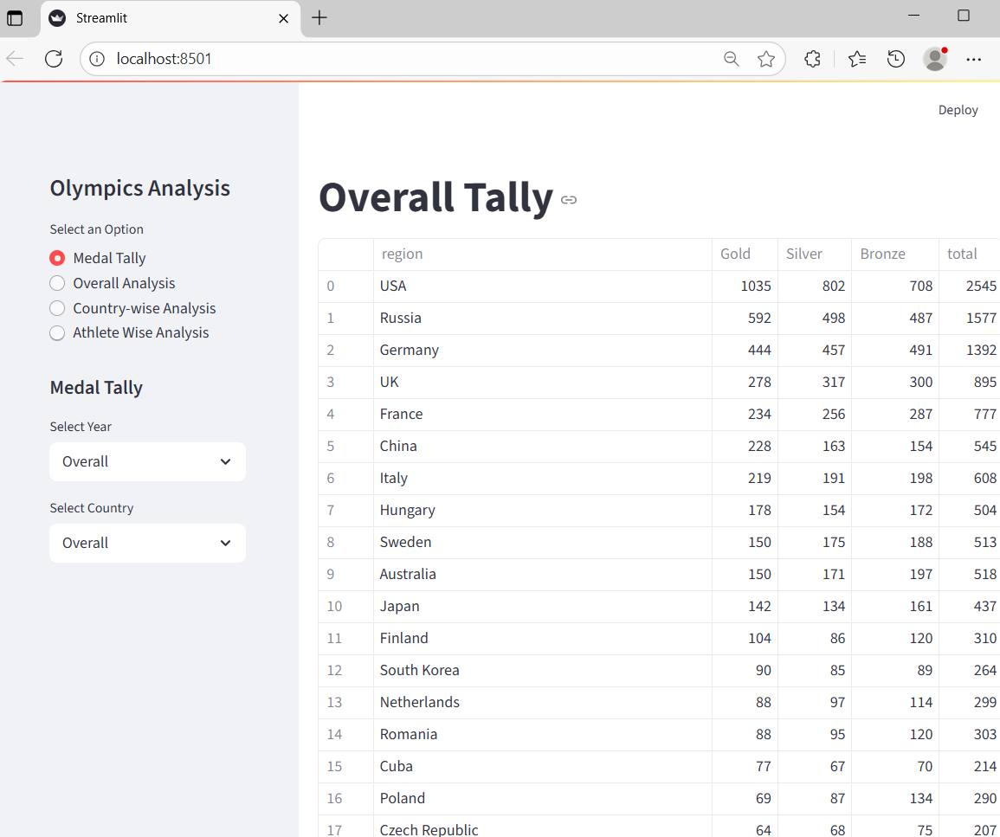
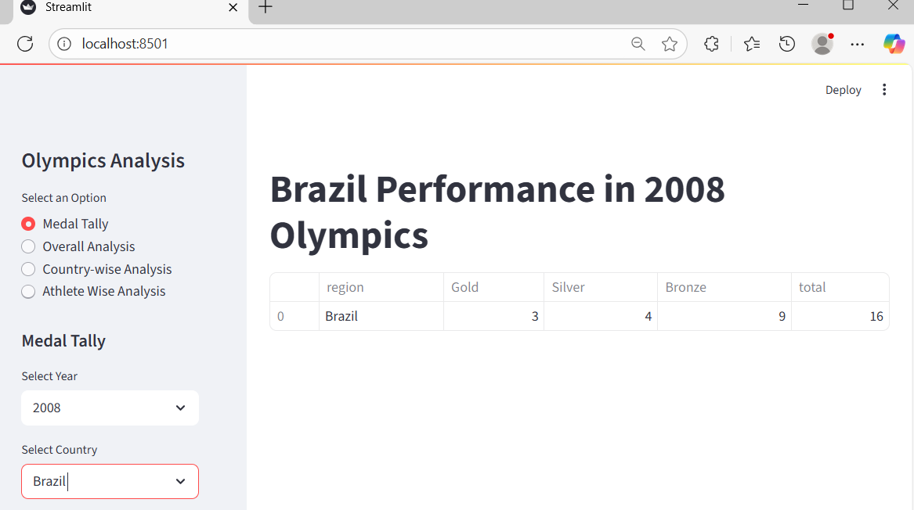
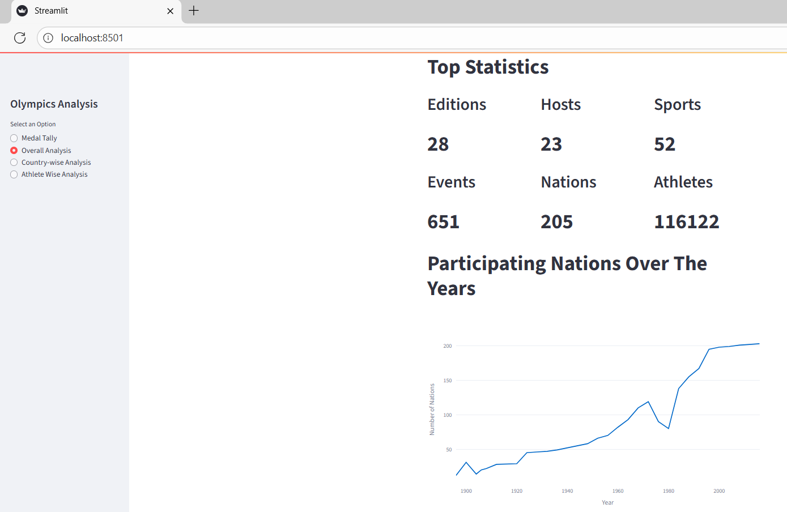
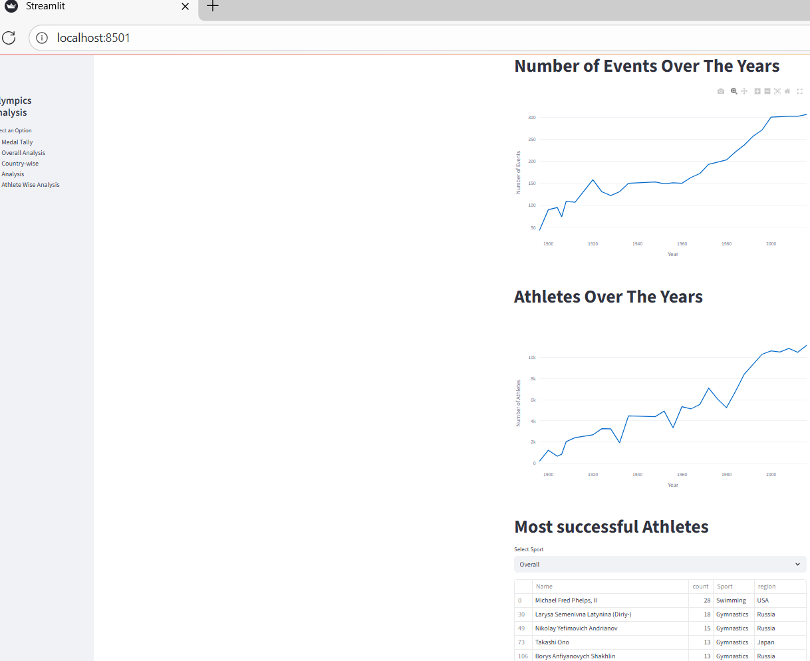
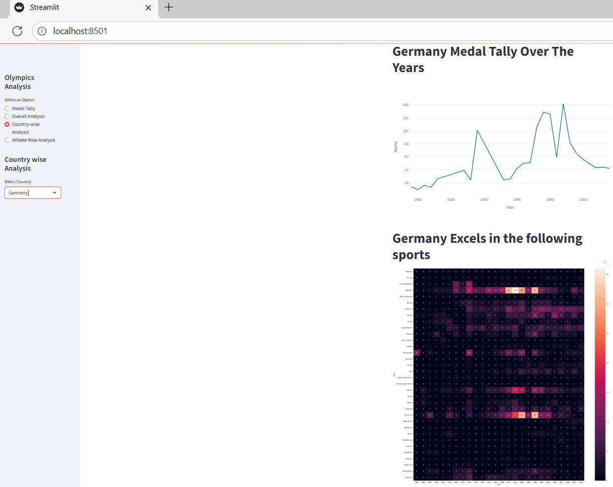
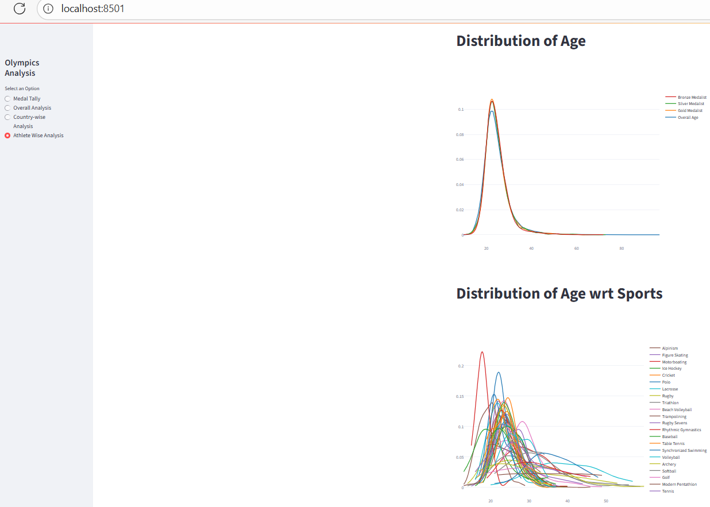
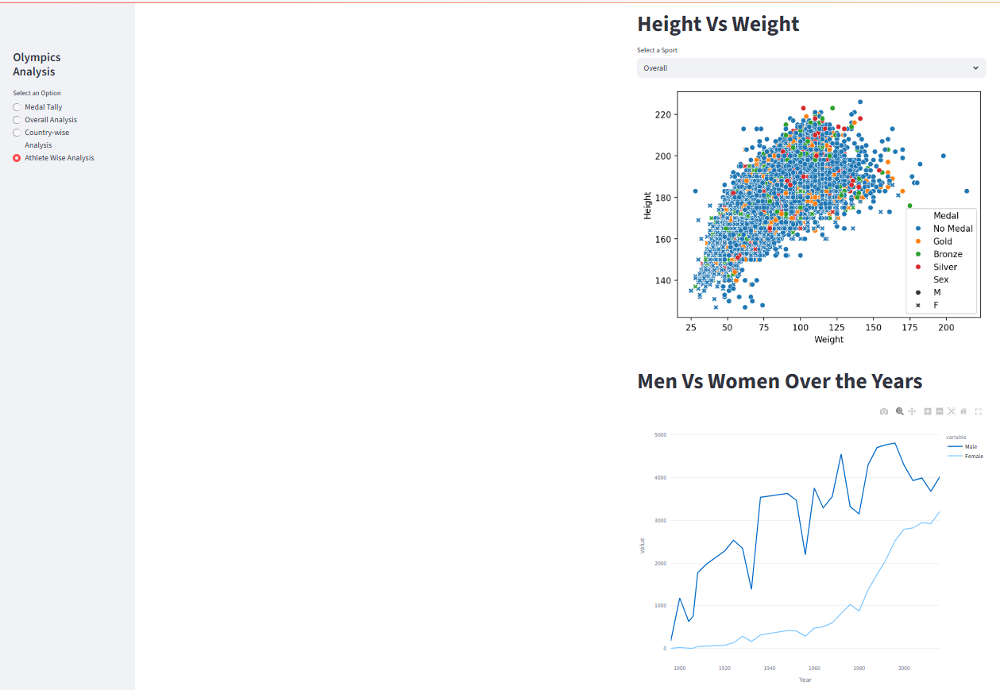

🏆 Olympics Analysis Web Application

This project is a Streamlit web application for comprehensive data analysis and visualization of historical Olympics data. It provides insights into medal tallies, overall game statistics, country-specific performance, and athlete characteristics. I have used python version 3.13.9.

📁 Project Structure

File/Folder,Description

app.py : "The main Streamlit application file. It defines the layout, user interface (sidebar, radio buttons), loads data, calls functions from preprocessor.py and helper.py, and renders all the visualizations and tables."

helper.py : "Contains core data processing functions used to calculate and retrieve data for the various analyses (e.g., medal tallies, country-year lists, data over time, successful athletes)."

preprocessor.py : "Contains the initial data cleaning and transformation logic (e.g., filtering for Summer Olympics, merging region data, one-hot encoding medals)."

athlete_events.csv,"Main dataset containing detailed information about all athletes and events in the Olympics (ID, Name, Sex, Height, Weight, Team, NOC, etc.). (Source: Kaggle)"

noc_regions.csv : Supporting dataset used to map NOC (National Olympic Committee) codes to the respective country names/regions.

requirements.txt : "(Assumed) Lists all necessary Python dependencies (like streamlit, pandas, plotly, seaborn) for the project."

gcode.py : "An unrelated Python script utilizing the winggcode library, likely for generating G-code for CNC hot-wire foam cutting of tapered wings. It is not part of the Olympics analysis."

.venv : "The project's virtual environment folder, which isolates dependencies."

How to Run the Application:
You need to have Python installed on your system(suggested version:3.13.9 . The required libraries are managed within the project's virtual environment (.venv).

Steps to be followed:

-Clone the repository and navigate to the directory.

-Install all dependencies from requirements.txt file using code : pip install -r requirements.txt

-Place the data files (athlete_events.csv, noc_regions.csv) in the same directory as app.py.

-Run the application from your terminal:

          streamlit run app.py
          
-The application will open automatically in your browser (typically at http://localhost:8501).

Key Insights & Visualizations:

1. Overall Analysis Highlights: Displays Top Statistics (Editions, Hosts, Sports, etc.), and visualizes the trend of Participating Nations, Events, and Athletes over time using line charts. It also features a table of the Most Successful Athletes.
2. Medal Tally: Allows filtering medal counts by Year and Country (or 'Overall').
3. Country-wise Analysis: Focuses on a selected country, showing its Medal Tally Over The Years, a Sports Heatmap (to see which sports it excels in by year), and its Top 10 Athletes.
4. Athlete Wise Analysis: Provides demographic insights, including Distribution of Age for all athletes versus medalists,Distribution of Age wrt Sports (for famous sports),Height Vs Weight scatter plot, filterable by sport ,Men Vs Women participation over the years.

_**Technical Implementation Details**_

**Data Preprocessing (preprocessor.py)**

Filtering: Only Summer Olympics data is retained (df=df[df['Season']=='Summer']).

Merging: The main dataframe is merged with noc_regions.csv on the NOC code to add the region (country name).

Cleaning: Duplicate entries are dropped.

Feature Engineering: One-hot encoding is applied to the Medal column, creating new columns: Gold, Silver, and Bronze (with values 0 or 1), facilitating easy medal counting.

**Helper Functions (helper.py)**

fetch_medal_tally: Calculates the medal tally based on the selected Year and Country filters, returning a DataFrame grouped by region (or year for country-specific overall data).

country_year_list: Generates the distinct, sorted lists of years and countries (including 'Overall') for the sidebar select boxes.

data_over_time: Calculates the number of unique entities (Nations, Events, Athletes) for each Olympic year, essential for the time-series line charts.

most_successful: Identifies the top 15 most successful athletes overall or in a specific sport, based on medal count.

weight_v_height: Prepares a DataFrame for the scatter plot, including filling Medal NaNs with 'No Medal', and filtering by a selected sport.

**Visualization Libraries**

The project leverages a mix of popular Python visualization libraries for different purposes:

Plotly Express (px): Used for creating interactive line charts (e.g., Nations Over Time) which are excellent for web apps.

Plotly Figure Factory (ff): Used for distribution plots (e.g., Age Distribution) to visualize multiple probability density functions.

Seaborn (sns) and Matplotlib (plt): Used for static plots like the Country Sports Heatmap and the Height Vs Weight scatter plot. Streamlit renders these static plots using st.pyplot(fig).

Output:

 Medal Tally:
  for overall analysis:
    
  for specific country(Here I've used Brazil):
    
 Overall Analysis:
   
    
 Country Wise Analysis:
   
 Athlete Wise Analysis: 
   
   

